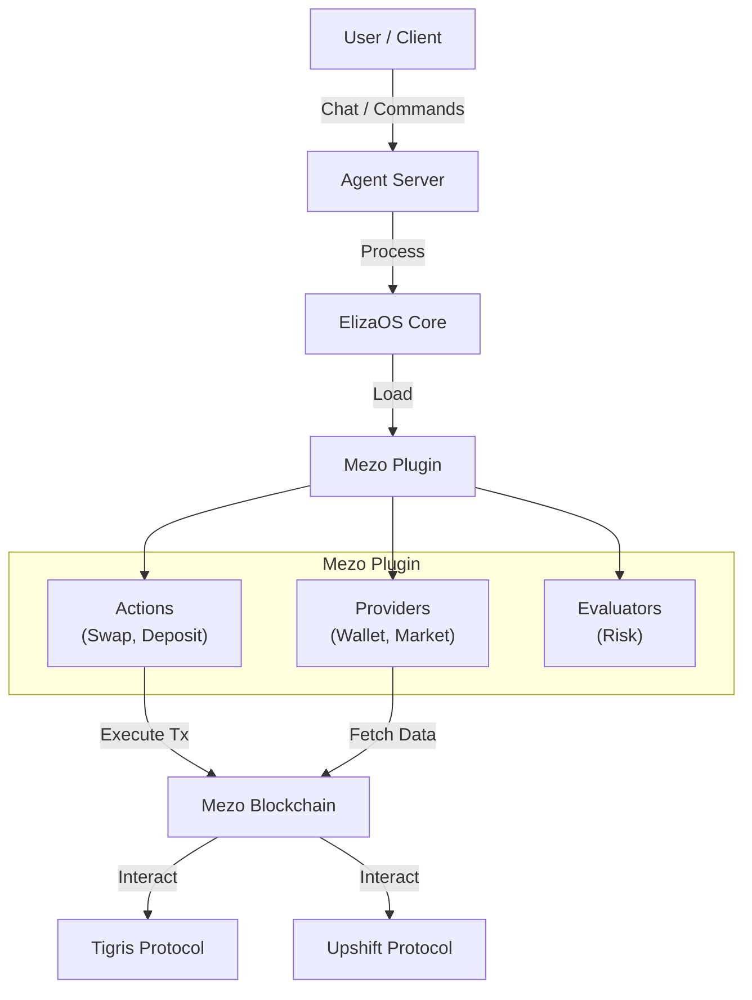

# Mezo Agent

**Mezo Agent** is an autonomous AI agent designed for decentralized finance (DeFi) operations on the Mezo ecosystem. Built on top of the powerful [ElizaOS](https://github.com/elizaos/eliza) framework, this agent is capable of executing complex financial strategies, managing assets, and interacting with core Mezo protocols like Tigris and Upshift.

##  Features

- **Autonomous Trading**: Execute swaps on **Tigris** with intelligent routing and execution.
- **Yield Optimization**: Automatically deposit and manage assets in **Upshift** for optimal yield generation.
- **Risk Management**: Real-time risk evaluation using custom evaluators ensures safe operations.
- **Market Analysis**: Integrated market data providers give the agent context-aware decision-making capabilities.
- **Wallet Integration**: Secure wallet management for signing and broadcasting transactions.

##  Architecture

Mezo Agent leverages a modular architecture to separate core agent logic from specific DeFi integrations.



### Components

- **Client**: The interface (Web or CLI) where users interact with the agent.
- **Server**: Hosted runtime that manages the agent lifecycle.
- **ElizaOS Core**: Handles the cognitive loop, memory, and model inference.
- **Mezo Plugin**: The heart of the DeFi integration, containing:
    - **Actions**: Executable capabilities like `swapTigris` and `depositUpshift`.
    - **Providers**: Context injectors like `walletProvider` for account state and `marketProvider` for price data.
    - **Evaluators**: Logic gates like `riskEvaluator` to validate safety before execution.

##  Getting Started

### Prerequisites

- [Node.js](https://nodejs.org/) (v23+)
- [Bun](https://bun.sh/)
- [WSL 2](https://learn.microsoft.com/en-us/windows/wsl/install-manual) (for Windows users)

### Installation

1.  **Clone the repository:**
    ```bash
    git clone https://github.com/Demiladepy/mezoagent.git
    cd mezoagent
    ```

2.  **Install dependencies:**
    ```bash
    bun install
    ```

3.  **Build the project:**
    ```bash
    bun run build
    ```

### Configuration

1.  **Environment Setup:**
    Duplicate the example environment file:
    ```bash
    cp .env.example .env
    ```

2.  **Edit `.env`:**
    Fill in your API keys and configuration. Critical variables for Mezo Agent:
    ```env
    # AI Model Provider
    OPENAI_API_KEY=sk-...

    # Mezo Configuration
    MEZO_PRIVATE_KEY=your_private_key
    MEZO_RPC_URL=https://rpc.mezo.org
    ```

### Running the Agent

Start the agent using the CLI or the start script:

```bash
bun run start
```

##  Project Structure

The project is a monorepo managed with Turbo:

- `packages/core`: Core agent logic.
- `packages/plugin-mezo`: **Mezo integration logic (Actions, Providers, Evaluators).**
- `packages/client`: React-based frontend.
- `packages/server`: Main entry point for the agent server.
- `packages/cli`: Command-line interface tools.

##  Contributing

Contributions are welcome! Please check the [CONTRIBUTING.md](CONTRIBUTING.md) for guidelines.

##  License

MIT
